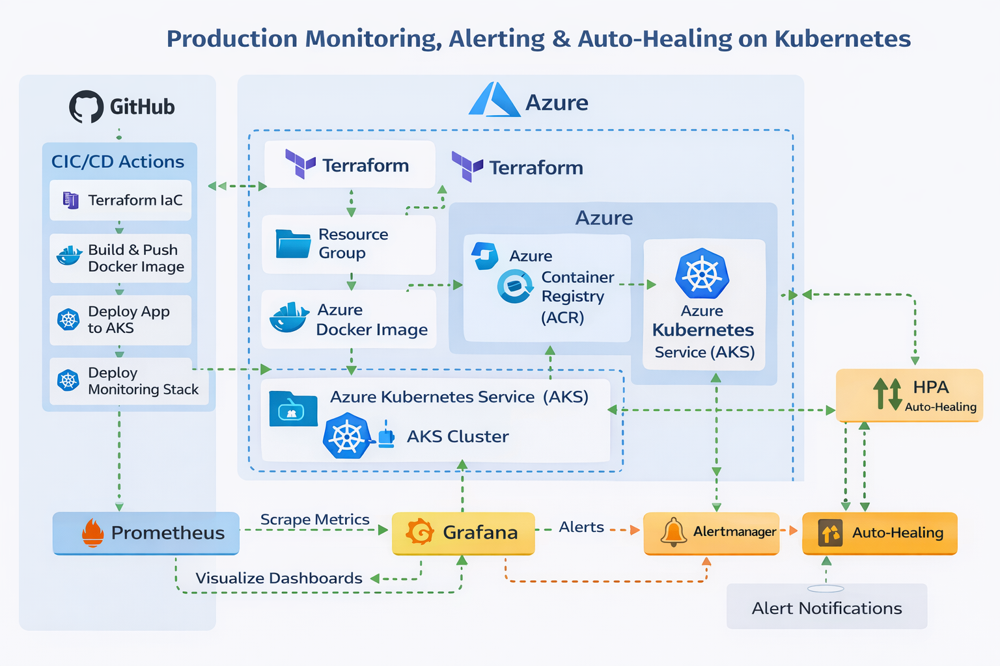

# Production Monitoring, Alerting & Auto-Healing on Kubernetes (SRE)

## Overview
This project demonstrates a **production-grade SRE monitoring, alerting, and auto-healing system** built on **Azure Kubernetes Service (AKS)** using **Infrastructure as Code, CI/CD automation, and cloud-native observability tools**.

The focus is not just deploying applications — but **keeping them reliable under failure**.

---

## 🎯 Key Objectives
- Provision AKS infrastructure using **Terraform**
- Deploy containerized applications via **GitHub Actions CI/CD**
- Implement **real-time monitoring** with Prometheus & Grafana
- Configure **alerting** using Alertmanager
- Enable **auto-healing & scaling** using Kubernetes + HPA
- Follow **SRE & DevOps best practices**

---

## High-Level Architecture



### Flow Summary:
1. Developer pushes code to GitHub
2. GitHub Actions pipeline triggers
3. Terraform provisions:
   - Resource Group
   - Azure Container Registry (ACR)
   - Azure Kubernetes Service (AKS)
4. Application image is built & pushed to ACR
5. App deployed to AKS
6. Prometheus scrapes metrics
7. Grafana visualizes dashboards
8. Alertmanager sends alerts
9. Kubernetes auto-heals failed pods

---

## Technology Stack

### Cloud & Infrastructure
- **Microsoft Azure**
- **Azure Kubernetes Service (AKS)**
- **Azure Container Registry (ACR)**

### IaC & Automation
- **Terraform**
- **GitHub Actions (OIDC authentication)**

### Containers & Orchestration
- **Docker**
- **Kubernetes**
- **Helm**

### Observability & SRE
- **Prometheus**
- **Grafana**
- **Alertmanager**
- **Horizontal Pod Autoscaler (HPA)**

---

## Repository Structure

```text
.
├── app/                    # Sample Node.js app exposing /health & /metrics
│   ├── Dockerfile
│   ├── package.json
│   └── server.js
│
├── terraform/              # Infrastructure as Code
│   ├── modules/
│   │   ├── aks/
│   │   ├── acr/
│   │   └── resource-group/
│   ├── environments/
│   │   └── dev/
│   └── main.tf
│
├── k8s/                    # Kubernetes manifests
│   └── app/
│       ├── deployment.yaml
│       ├── service.yaml
│       └── hpa.yaml
│
├── monitoring/             # Monitoring configs (Helm-based)
│
├── .github/workflows/
│   └── sre-aks-ci-cd.yml   # End-to-end CI/CD pipeline
│
└── README.md
